# MediMate 💊  
### Smart Medication Tracking Web App

MediMate is a **mobile-first medication management web application** that helps users track prescriptions, log doses, monitor medication inventory, and receive reminders to stay on schedule.

The application integrates **real-time notifications, prescription OCR scanning, pharmacy geolocation, and inventory tracking** to provide a complete medication management experience.

🔗 **Live App:**  
https://project2-e9097.web.app

---

# Why MediMate?

Many people forget to take medications or realize they are out of medicine too late. Most medication apps focus only on reminders but **fail to track inventory or assist with refills**.

MediMate solves this problem by combining:

- Medication reminders
- Inventory tracking
- Prescription scanning
- Nearby pharmacy discovery

All in one **mobile-friendly web application**.

---

# Key Features

## 1. User Authentication & Privacy

Users must sign in to access the application.

Features include:

- Secure login using **Firebase Authentication**
- User-specific medication data storage
- Data isolation so users only see their own records

---

# 2. Medication Management (CRUD)

Users can fully manage their medications:

- Add medications
- View all medications
- Edit medication details
- Delete medications

Each medication includes information such as:

- Medication name
- Dosage
- Schedule
- Quantity remaining
- Refill information

---

# 3. Medication Scheduler

The system automatically determines when medications are due based on schedules.

Supported schedule types:

- Everyday
- Specific Days
- Every Few Days
- Custom schedules

If a medication time is not specified, the system defaults to **9:00 AM on the due date**.

---

# 4. Dose Logging

Users can quickly log when they take a medication.

Logging a dose automatically:

- Updates medication history
- Reduces inventory
- Updates refill estimates

---

# 5. Inventory Tracking

MediMate tracks medication supply in real time.

Features include:

- Automatic stock reduction when doses are taken
- Inventory display for each medication
- Low-stock notifications
- Refill reminders before medications run out

---

# 6. Smart Notifications

The app supports both **in-app and system notifications**.

### In-App Notifications
- Toast notifications within the application

### System Notifications
- Browser-level push notifications
- Reminders when medication is due
- Alerts when medication inventory is low

Users must enable browser notification permissions.

---

# 7. Prescription OCR (Camera + Image Upload)

Users can scan prescriptions to automatically populate medication information.

Features include:

- Capture prescription images using the **device camera**
- Upload prescription images from device storage
- Extract text using **OCR**
- Parse medication details using **RegEx processing**

OCR helps convert **unstructured prescription images into structured medication records**.

All OCR processing happens **locally in the browser** for privacy.

---

# 8. Geolocation & Pharmacy Finder

The application can determine the **nearest pharmacy** using device location.

Features include:

- Detect user location using browser geolocation
- Automatically identify nearby pharmacies
- Store preferred pharmacy
- Show pharmacy location when medication stock runs low

---

# 9. Device Integrations

MediMate integrates several browser device capabilities:

- 📷 **Camera** – Scan prescriptions
- 📍 **Location** – Detect nearby pharmacies
- 🔔 **System Notifications** – Medication reminders
- 📂 **File Picker** – Upload prescription images

---

# App Screens

## Splash Page

Application entry screen for authentication.
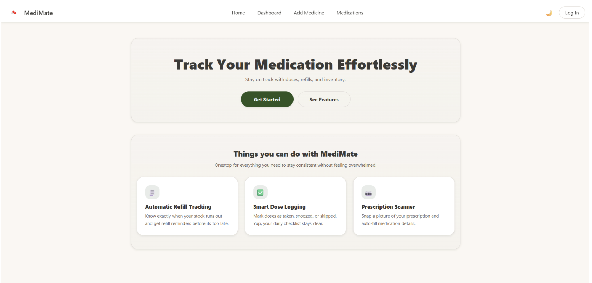

## Dashboard

Displays today's medications, notifications, and quick actions.
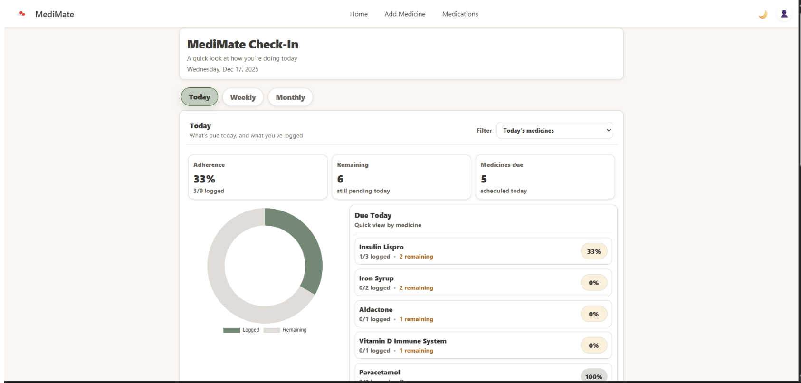

## Log Medication

Users can log medication doses directly from the dashboard.
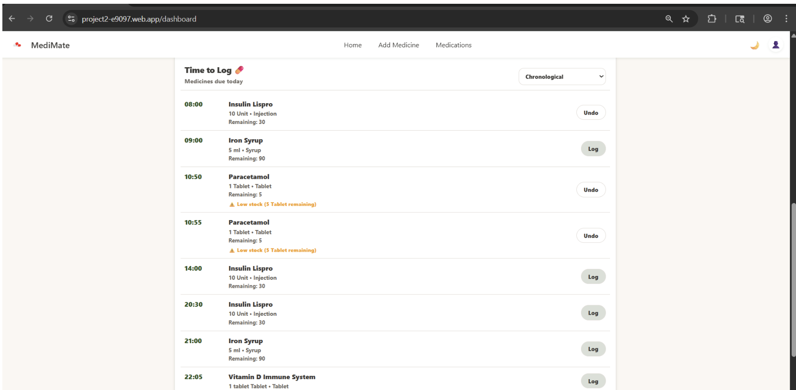

## Add Medication (with OCR)

Scan or upload prescription images to automatically populate medication information.
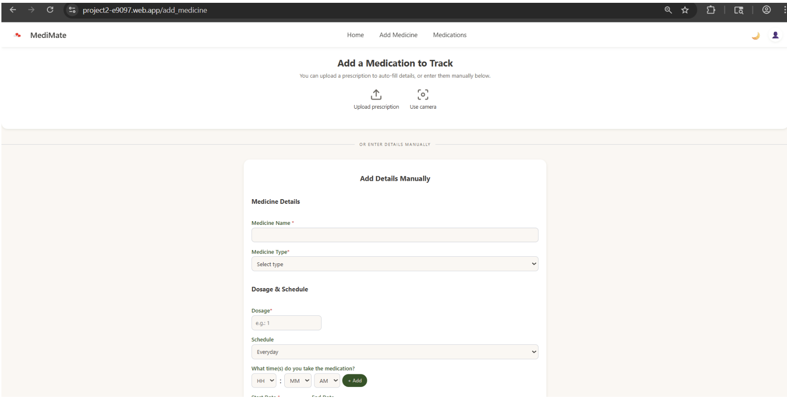
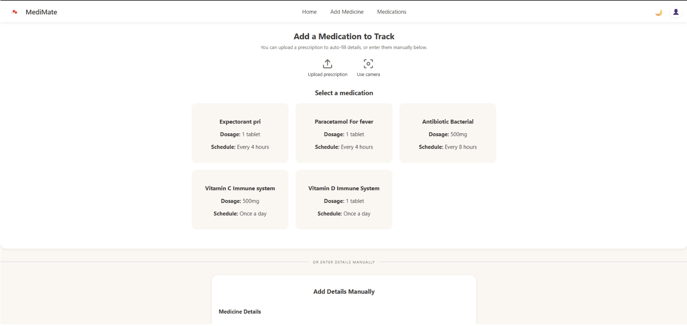
## My Medications

List view of all medications with editing options.

## Edit Medication

Modify medication details, schedules, or dosage.
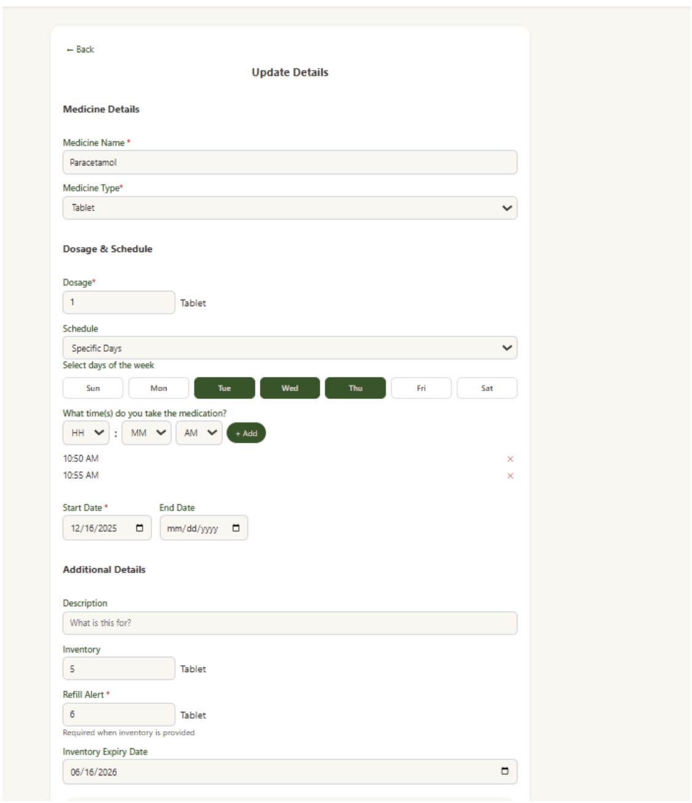

## Inventory View

Displays current stock levels and refill estimates.
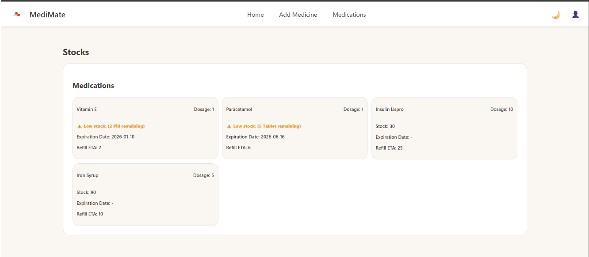

## Settings

Manage:

- Notification preferences
- Pharmacy preferences
- Location permissions
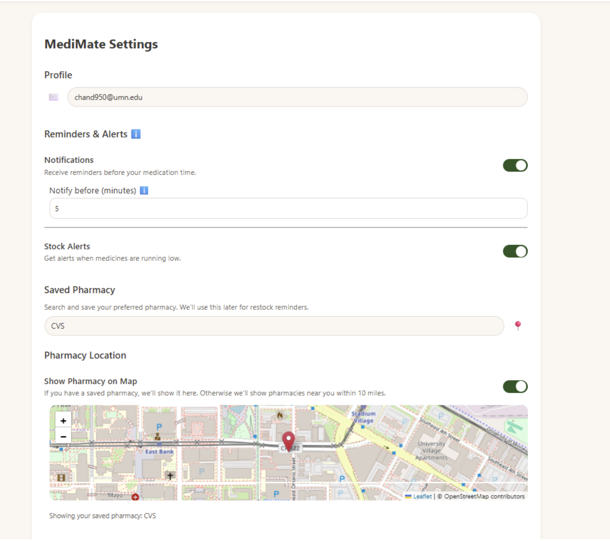

## Notifications

- Medication Notification
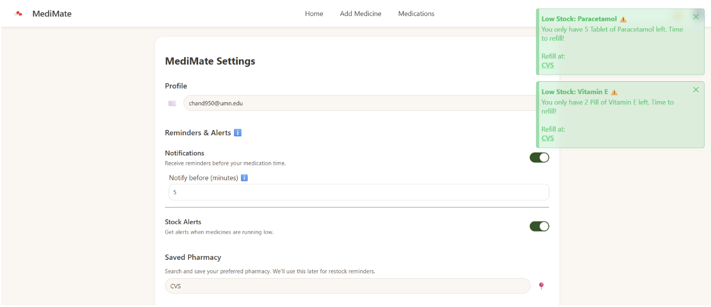
- Inventory Notification
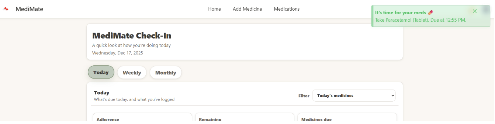
- System Notification
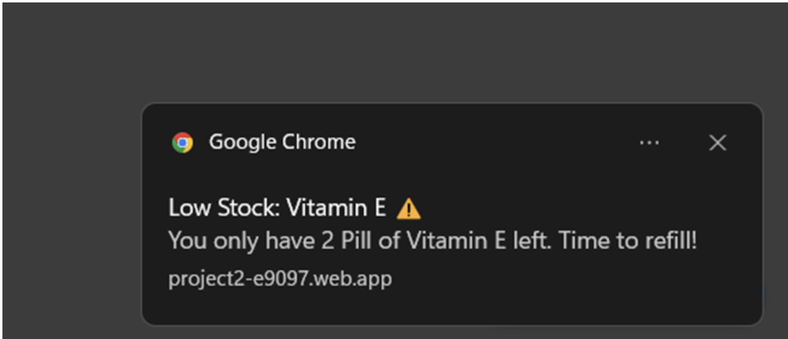

---

# Tech Stack

## Frontend
- Vue.js
- Vue Router
- PrimeVue (UI components)
- Lucide Icons

## Backend / Database
- Firebase Authentication
- Firebase Firestore
- Firebase Hosting

## APIs & Libraries

### Tesseract.js
Used for **Optical Character Recognition (OCR)** to extract text from prescription images.

### Browser Media APIs
`getUserMedia()` allows the application to access the device camera.

### Leaflet + ArcGIS
Used to implement:

- Pharmacy location mapping
- Proximity-based pharmacy detection

---

# Project Architecture

The application follows a **Single Page Application (SPA)** architecture built with Vue.

Key components include:

- Authentication components
- Medication management views
- Notification system
- OCR processing pipeline
- Pharmacy geolocation services

All medication data is stored per user using Firestore collections.

---

# Testing Notes

To properly test the application:

- Notifications must be enabled in **Settings**
- Browser notification permissions must be granted
- A pharmacy must be saved to receive pharmacy-related alerts
- Location access must be allowed for automatic pharmacy detection

Medication scheduling normally runs every **5 minutes**, but it is currently configured to run **hourly** to reduce cloud usage.

The application works best on **Android devices**. iOS support may vary.

---

# External Dependencies

### Tesseract.js
Used for local OCR processing of prescription images.

### Leaflet
Interactive map rendering and pharmacy visualization.

### ArcGIS Services
Used for location lookup and pharmacy proximity detection.

### PrimeVue
UI components for responsive layouts and interactions.

### Lucide
Icon library used across the UI.

---

# Privacy Considerations

- OCR processing occurs **entirely in the browser**
- No prescription images are sent to external servers
- All medication data is stored securely under user accounts

---
